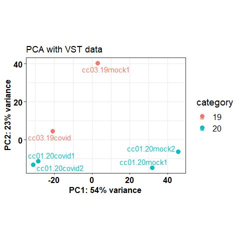
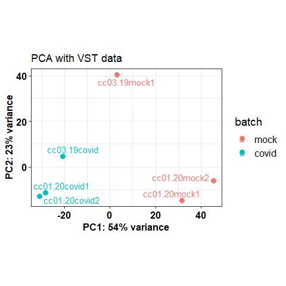
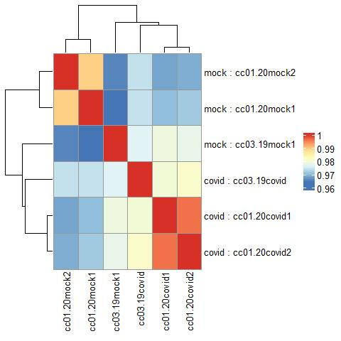
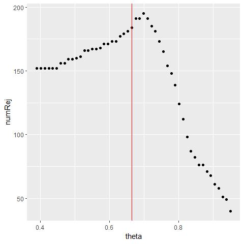
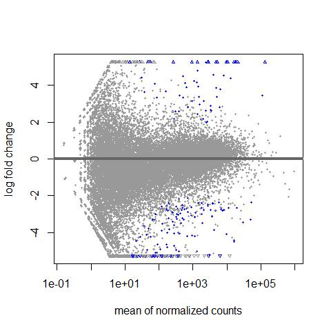
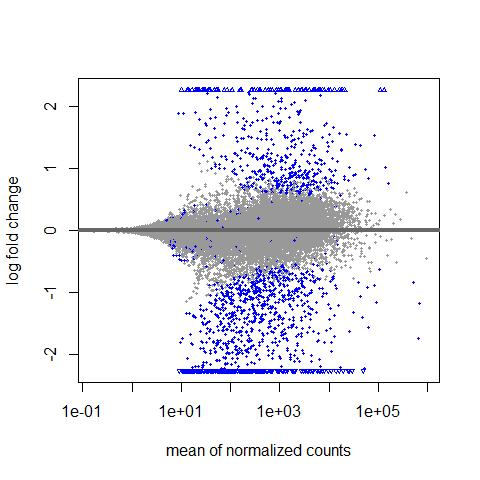
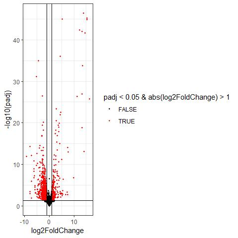

Assignment 3
================
Rohit Satyam
11/20/2021

-   [Loading Libraries](#loading-libraries)
-   [Basic QC](#basic-qc)
-   [Differential Expression
    Analysis](#differential-expression-analysis)
-   [Session Information](#session-information)

## Loading Libraries

We will first load the necessary libraries.

``` r
# setwd("~/assignment3")
library(DESeq2)
library(ggplot2)
library("BiocParallel")
library(org.Hs.eg.db)
library(dplyr)
library(tibble)
library(ggrepel)
library(pheatmap)
library(ComplexHeatmap)
set.seed(1000)
```

Now we will read the count matrix using the DESeq2
`DESeqDataSetFromMatrix` function. We will also make unique name out of
gene symbols and later on recover them after DE Expression analysis.

``` r
## Reading count file and then making unique row names
file <- read.csv("GSE160435_count.csv")
file$X <- paste0(seq_len(length(file$X)),"_",file$X)
rownames(file) <- file$X
file <- file[,-1]
cts <- as.matrix(file)
coldata <- data.frame(sample=colnames(cts),batch=c("covid","covid","covid","mock","mock","mock"),category=c("20","20","19","20","20","19"))
dds <- DESeqDataSetFromMatrix(countData = cts,
                              colData = coldata,
                              design = ~ batch + category)
```

    ## Warning in DESeqDataSet(se, design = design, ignoreRank): some variables in
    ## design formula are characters, converting to factors

``` r
## Checking if the levels order is right

dds$batch
```

    ## [1] covid covid covid mock  mock  mock 
    ## Levels: covid mock

``` r
## Changing the reference level to mock samples
dds$batch <- relevel(dds$batch, ref = "mock")
dds$batch
```

    ## [1] covid covid covid mock  mock  mock 
    ## Levels: mock covid

As shown above, the reference level was changed to `mock` by using
`relevel` function.

## Basic QC

Before performing DE Analysis, it is good practice to perform Post
alignment QC which involves performing PCA analysis and Sample-Sample
correlation. This is usually performed on `VST` normalised data because
it harmonises the data appropriately for such algorithms that works well
only for dataset exhibiting Poission Distribution.

Such transformation can be achieved by using `vst` function.We then
calculate variability along first two PC’s to see if similar samples
cluster together or if there is any discrepency.Shall there be any
discrepency found, it must be accounted for in our design formula
mentioned above.

``` r
vsd = vst(object = dds, blind = TRUE,# do not take the design formula into account; best practice for sample-level QC
                                        fitType = "parametric")
pcaData <- plotPCA(vsd, intgroup = c("batch","category"), returnData = TRUE)
pcaData
```

    ##                      PC1        PC2    group batch category          name
    ## cc01.20covid1 -28.412811 -11.335658 covid:20 covid       20 cc01.20covid1
    ## cc01.20covid2 -30.945644 -12.953513 covid:20 covid       20 cc01.20covid2
    ## cc03.19covid  -20.740332   4.691822 covid:19 covid       19  cc03.19covid
    ## cc01.20mock2   45.510065  -6.177389  mock:20  mock       20  cc01.20mock2
    ## cc01.20mock1   31.608525 -14.716303  mock:20  mock       20  cc01.20mock1
    ## cc03.19mock1    2.980196  40.491041  mock:19  mock       19  cc03.19mock1

``` r
percentVar <- round(100 * attr(pcaData, "percentVar"))
## Seeing if samples cluster majorly according to category
t <- ggplot(pcaData, aes(x = PC1, y = PC2, color = category, label=name)) +
    geom_point(size =3) +
    xlab(paste0("PC1: ", percentVar[1], "% variance")) +
    ylab(paste0("PC2: ", percentVar[2], "% variance")) +
    coord_fixed() +
    ggtitle("PCA with VST data") +theme_bw()+theme(axis.text.x = element_text(face="bold", color="black", size=12),axis.text.y = element_text(face="bold", color="black", size=12))+theme(axis.title.x = element_text(face="bold", colour = "black", size=12), axis.title.y = element_text(face="bold", colour = "black", size=12))+theme(legend.text=element_text(size=12),legend.title=element_text(size=14))
 t+geom_text_repel()
```

<!-- -->

``` r
## Seeing if samples cluster majorly according to batch
t <- ggplot(pcaData, aes(x = PC1, y = PC2, color = batch, label=name)) +
    geom_point(size =3) +
    xlab(paste0("PC1: ", percentVar[1], "% variance")) +
    ylab(paste0("PC2: ", percentVar[2], "% variance")) +
    coord_fixed() +
    ggtitle("PCA with VST data") +theme_bw()+theme(axis.text.x = element_text(face="bold", color="black", size=12),axis.text.y = element_text(face="bold", color="black", size=12))+theme(axis.title.x = element_text(face="bold", colour = "black", size=12), axis.title.y = element_text(face="bold", colour = "black", size=12))+theme(legend.text=element_text(size=12),legend.title=element_text(size=14))
 t+geom_text_repel()
```

<!-- -->

``` r
## Another QC plot is correlation heatmap which cluster samples with similar expression profile together. This is a good way to observe if any kind of sample swapping occured or not.
t <- cor(assay(vsd))
rownames(t) <- paste(colData(vsd)$batch,rownames(t), sep = " : ")

pheatmap(t)
```

<!-- -->

## Differential Expression Analysis

The differential Expression Analysis for this simple experiment is easy.
All you need to use is `DESeq` function that will perform all steps for
you. The results of DE analysis can be obtained using `results`
function. I used LFC threshold which means I consider a gene to be DE if
it exhibit 2 FC and have P-value of 0.05

`metadata(res)$filterThreshold:` The results of this command means that
genes with basemean &lt; 4.717859 have been filtered. This represents
64.12336% of all tested genes!

The plot shown below shows the number of rejections over the basemean
quantiles. The threshold chosen (red vertical line) is the lowest
quantile for which the number of rejections is within 1 residual
standard deviation to the peak of the curve.

``` r
dds <- DESeq(dds)
```

    ## estimating size factors

    ## estimating dispersions

    ## gene-wise dispersion estimates

    ## mean-dispersion relationship

    ## final dispersion estimates

    ## fitting model and testing

``` r
resultsNames(dds) # lists the coefficients
```

    ## [1] "Intercept"           "batch_covid_vs_mock" "category_20_vs_19"

``` r
res <- results(dds, contrast=c("batch","covid","mock"), lfcThreshold = 1, alpha = 0.05)
res
```

    ## log2 fold change (MLE): batch covid vs mock 
    ## Wald test p-value: batch covid vs mock 
    ## DataFrame with 60673 rows and 6 columns
    ##                      baseMean log2FoldChange     lfcSE      stat      pvalue
    ##                     <numeric>      <numeric> <numeric> <numeric>   <numeric>
    ## 1_TSPAN6           4113.37824      0.1079694  0.324443  0.000000    1.000000
    ## 2_TNMD                1.55577     -0.7683063  3.788857  0.000000    1.000000
    ## 3_DPM1             1866.32059      0.2748401  0.317607  0.000000    1.000000
    ## 4_SCYL3             833.60967     -0.0027392  0.325549  0.000000    1.000000
    ## 5_C1orf112          476.21171      1.2537083  0.539465  0.470296    0.638144
    ## ...                       ...            ...       ...       ...         ...
    ## 60669_virus_ORF6      2755.47        13.3249   1.15137  10.70451 9.69399e-27
    ## 60670_virus_ORF7a    16714.15        15.3236   1.03757  13.80489 2.38121e-43
    ## 60671_virus_ORF8     17764.58        15.4326   1.03742  13.91203 5.35359e-44
    ## 60672_virus_S        19076.45        12.5001   0.87099  13.20351 8.37454e-40
    ## 60673_virus_ORF1ab   18182.82        14.5891   1.76875   7.68289 1.55540e-14
    ##                           padj
    ##                      <numeric>
    ## 1_TSPAN6                     1
    ## 2_TNMD                      NA
    ## 3_DPM1                       1
    ## 4_SCYL3                      1
    ## 5_C1orf112                   1
    ## ...                        ...
    ## 60669_virus_ORF6   2.19515e-23
    ## 60670_virus_ORF7a  1.61764e-39
    ## 60671_virus_ORF8   5.45530e-40
    ## 60672_virus_S      2.84455e-36
    ## 60673_virus_ORF1ab 1.76106e-11

``` r
 metadata(res)$filterThreshold
```

    ## 66.41052% 
    ##  6.995792

``` r
as_tibble(metadata(res)$filterNumRej) %>%
    ggplot(aes(x = theta, y = numRej)) +
    geom_point() +
    geom_vline(xintercept = 0.6641052,
               color = 'red')
```

<!-- -->

Another interesting plot is the MA-plot (“Mean-Average” plot), a scatter
plot of log2FC versus the mean of normalised counts. Genes with a
padjusted value lower than 0.05 are colored. The plot highlights the
fact that genes with low read counts show substantially higher
variability than highly expressed genes, resulting in a strong log2FC
even though are likely not really differentially expressed. In the
MA-plot, we hope to observe some genes located in the upper/lower right
quadrant of the plots (the most interesting candidates).

``` r
plotMA(res)
```

<!-- -->

``` r
reslfcShrink <- lfcShrink(dds,
                 coef=2, type = 'apeglm')
```

    ## using 'apeglm' for LFC shrinkage. If used in published research, please cite:
    ##     Zhu, A., Ibrahim, J.G., Love, M.I. (2018) Heavy-tailed prior distributions for
    ##     sequence count data: removing the noise and preserving large differences.
    ##     Bioinformatics. https://doi.org/10.1093/bioinformatics/bty895

``` r
plotMA(reslfcShrink)
```

<!-- -->

``` r
results <- data.frame(reslfcShrink)
results$symbol <- gsub("^.*?_","",rownames(results))
write.csv(results,"LFCShrink.csv")
```

> We should and will use shrunken LFC values for Function enrichment
> analysis and ranking genes or to report results.

The DE genes can be viewed as a volcano plot using the following code
snippet.

``` r
data.frame(reslfcShrink) %>%
    filter(!is.na(padj)) %>%
    ggplot(aes(x = log2FoldChange, y = -log10(padj),
               color = padj < 0.05 & abs(log2FoldChange) > 1)) +
    scale_colour_manual(values = c("black", "red")) +
    geom_point(size = 0.8) +
    geom_hline(yintercept = -log10(0.05)) +
    geom_vline(xintercept = 1) +
    geom_vline(xintercept = -1)+theme_bw()
```

<!-- -->

## Session Information

``` r
sessionInfo()
```

    ## R version 4.1.0 (2021-05-18)
    ## Platform: x86_64-w64-mingw32/x64 (64-bit)
    ## Running under: Windows 10 x64 (build 19043)
    ## 
    ## Matrix products: default
    ## 
    ## locale:
    ## [1] LC_COLLATE=English_United States.1252 
    ## [2] LC_CTYPE=English_United States.1252   
    ## [3] LC_MONETARY=English_United States.1252
    ## [4] LC_NUMERIC=C                          
    ## [5] LC_TIME=English_United States.1252    
    ## 
    ## attached base packages:
    ##  [1] grid      parallel  stats4    stats     graphics  grDevices utils    
    ##  [8] datasets  methods   base     
    ## 
    ## other attached packages:
    ##  [1] ComplexHeatmap_2.8.0        pheatmap_1.0.12            
    ##  [3] ggrepel_0.9.1               tibble_3.1.5               
    ##  [5] dplyr_1.0.7                 org.Hs.eg.db_3.13.0        
    ##  [7] AnnotationDbi_1.54.1        BiocParallel_1.26.1        
    ##  [9] ggplot2_3.3.5               DESeq2_1.32.0              
    ## [11] SummarizedExperiment_1.22.0 Biobase_2.52.0             
    ## [13] MatrixGenerics_1.4.3        matrixStats_0.61.0         
    ## [15] GenomicRanges_1.44.0        GenomeInfoDb_1.28.1        
    ## [17] IRanges_2.26.0              S4Vectors_0.30.0           
    ## [19] BiocGenerics_0.38.0        
    ## 
    ## loaded via a namespace (and not attached):
    ##  [1] bitops_1.0-7           bit64_4.0.5            doParallel_1.0.16     
    ##  [4] RColorBrewer_1.1-2     httr_1.4.2             numDeriv_2016.8-1.1   
    ##  [7] tools_4.1.0            utf8_1.2.2             R6_2.5.1              
    ## [10] DBI_1.1.1              colorspace_2.0-2       apeglm_1.14.0         
    ## [13] GetoptLong_1.0.5       withr_2.4.2            tidyselect_1.1.1      
    ## [16] bit_4.0.4              compiler_4.1.0         Cairo_1.5-12.2        
    ## [19] DelayedArray_0.18.0    labeling_0.4.2         scales_1.1.1          
    ## [22] mvtnorm_1.1-2          genefilter_1.74.0      stringr_1.4.0         
    ## [25] digest_0.6.27          rmarkdown_2.11         XVector_0.32.0        
    ## [28] pkgconfig_2.0.3        htmltools_0.5.2        bbmle_1.0.24          
    ## [31] highr_0.9              fastmap_1.1.0          rlang_0.4.11          
    ## [34] GlobalOptions_0.1.2    RSQLite_2.2.8          farver_2.1.0          
    ## [37] shape_1.4.6            generics_0.1.0         RCurl_1.98-1.5        
    ## [40] magrittr_2.0.1         GenomeInfoDbData_1.2.6 Matrix_1.3-4          
    ## [43] Rcpp_1.0.7             munsell_0.5.0          fansi_0.5.0           
    ## [46] lifecycle_1.0.0        stringi_1.7.4          yaml_2.2.1            
    ## [49] MASS_7.3-54            zlibbioc_1.38.0        plyr_1.8.6            
    ## [52] blob_1.2.2             bdsmatrix_1.3-4        crayon_1.4.1          
    ## [55] lattice_0.20-44        Biostrings_2.60.1      splines_4.1.0         
    ## [58] annotate_1.70.0        circlize_0.4.13        KEGGREST_1.32.0       
    ## [61] magick_2.7.3           locfit_1.5-9.4         knitr_1.34            
    ## [64] pillar_1.6.2           rjson_0.2.20           geneplotter_1.70.0    
    ## [67] codetools_0.2-18       XML_3.99-0.8           glue_1.4.2            
    ## [70] evaluate_0.14          png_0.1-7              vctrs_0.3.8           
    ## [73] foreach_1.5.1          gtable_0.3.0           purrr_0.3.4           
    ## [76] clue_0.3-59            assertthat_0.2.1       emdbook_1.3.12        
    ## [79] cachem_1.0.6           xfun_0.26              xtable_1.8-4          
    ## [82] coda_0.19-4            survival_3.2-13        iterators_1.0.13      
    ## [85] memoise_2.0.0          cluster_2.1.2          ellipsis_0.3.2
